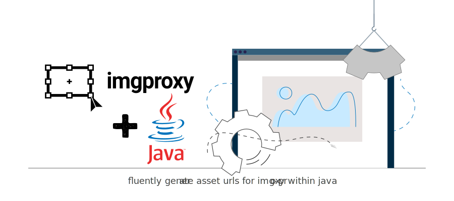

# imgproxy-java




[](https://travis-ci.org/rocketbase-io/imgproxy-java)
[](https://maven-badges.herokuapp.com/maven-central/io.rocketbase.asset/imgproxy)

fluently generate asset urls for img-proxy within java

## example usage

````java
// simple unsigned 
String url = Signature.of(new SignatureConfiguration(BASE_URL))
                .size(100, 100)
                .url(SOURCE_URL)


// advanced with key + salt
Signature signature = Signature.of(new SignatureConfiguration(imgproxyProperties.getBaseurl(),
                    imgproxyProperties.getKey(),
                    imgproxyProperties.getSalt()));

signature.resize(ResizeType.fit, 300, 300, true);
String url = signature.url("s3://bucket-name/" + assetReference.getUrlPath());

````